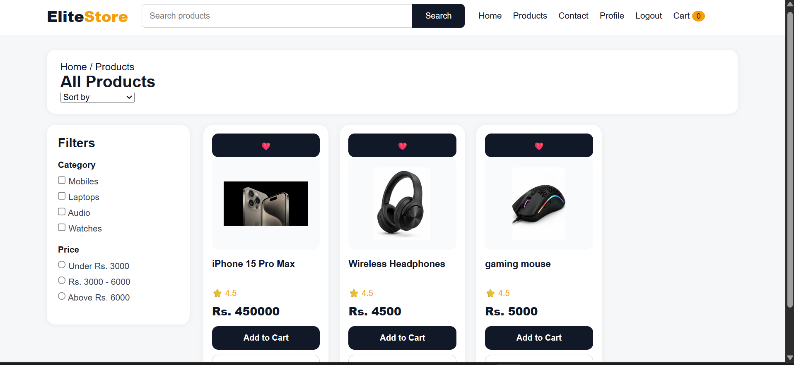
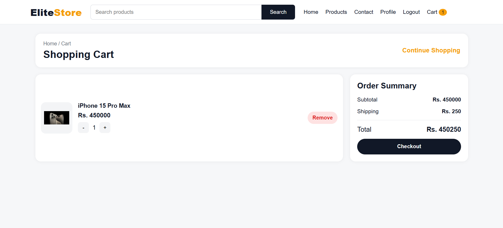
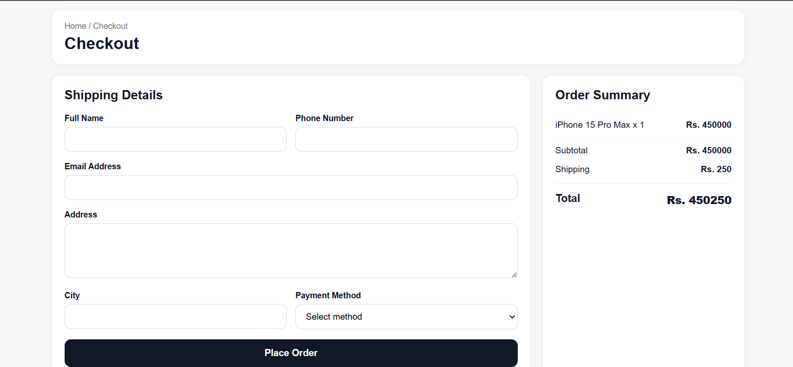

## Elite Store - Full Stack E-Commerce Website
A modern Full Stack E-Commerce Website built using **HTML, CSS, JavaScript, Node.js, Express.js, and MongoDB**. The project provides a complete online shopping experience with secure authentication, product management, shopping cart, wishlist, checkout, order management, and an admin dashboard.
## 🚀 Features
## 👤 User Features
- User Registration & Login
- Secure Authentication
- Responsive Home Page
- Product Listing
- Product Details
- Product Search
- Shopping Cart
- Wishlist
- Checkout System
- Order History
- User Profile
## 👨‍💼 Admin Features
- Admin Dashboard
- Add New Products
- Edit Products
- Delete Products
- Upload Product Images (Multer)
- Manage Customer Orders
- Update Order Status
- Product Management
 ## 🛠 Tech Stack
Frontend:-
- HTML5
- CSS3
- JavaScript
# Backend:-
- Node.js
- Express.js
# Database:-
- MongoDB
- Mongoose
# Additional Tools:-
- JWT Authentication
- Multer
- Git
- GitHub
# 📂 Project Structure
```
EliteStore/
│
├── backend/
│   ├── config/
│   ├── controllers/
│   ├── middleware/
│   ├── models/
│   ├── routes/
│   ├── uploads/
│   ├── server.js
│   └── package.json
│
├── frontend/
│   ├── admin/
│   ├── css/
│   ├── images/
│   ├── js/
│   ├── index.html
│   └── ...
│
├── screenshots/
│
└── README.md
```
# 📷 Project Screenshots
## 🏠 Products Page

## 🛒 Shopping Cart

## 💳 Checkout

## ✅ Order Success Page

## 👤 Customer Profile

## 👨‍💼 Admin Dashboard

## ➕ Add Product

## 📦 Manage Products

## 📋 Order Management

## 🗄 MongoDB Database

## 👥 Users Collection

## 📦 Products Collection

## 🛒 Cart Collection

## 📑 Orders Collection

# ⚙️ Installation
## Clone the Repository
git clone https://github.com/lizaykhan5-byte/fullstack-ecommerce.git
## Backend Setup
```bash
cd backend
npm install
npm start
## Frontend Setup
Open the **frontend** folder using **VS Code Live Server**.
# 🎯 Future Improvements
- Online Payment Gateway Integration
- Email Notifications
- Product Reviews & Ratings
- Coupon & Discount System
- Sales Analytics Dashboard
- Live Chat Support
- Product Categories & Filters
- Responsive Performance Improvements
# 👩‍💻 Developer
**Lizay Khan**
BS Information Technology Student
GitHub:
https://github.com/lizaykhan5-byte
⭐ If you like this project, don't forget to star this repository.